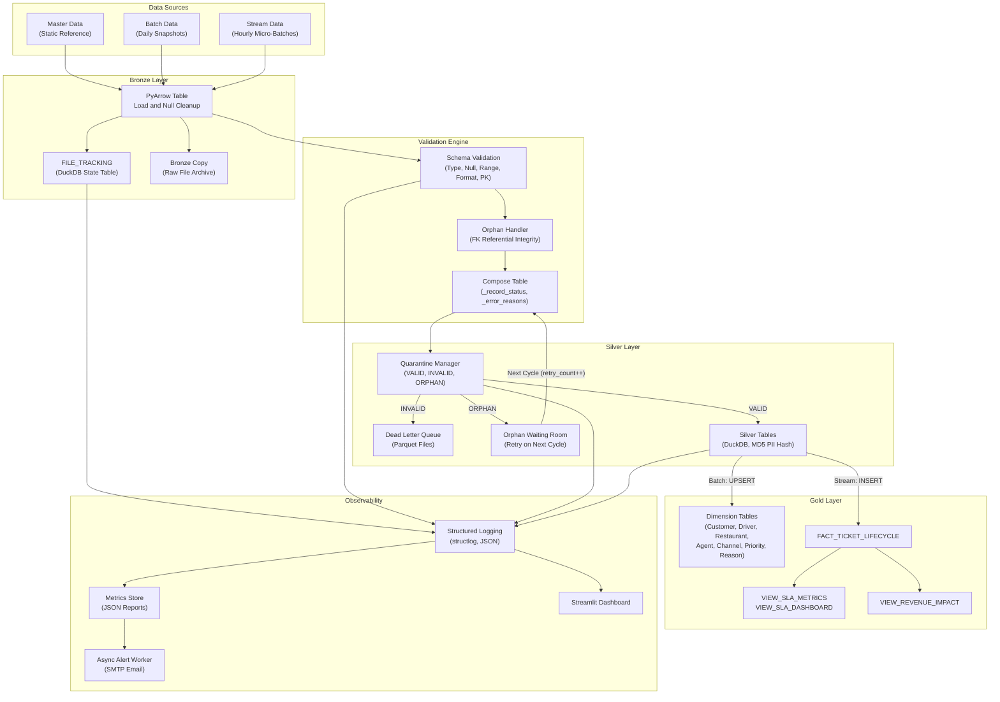

# FastFeast Data Solution

A configuration-driven ELT pipeline and analytical data warehouse for food delivery operations. The system ingests master, batch, and stream data through a Medallion Architecture (Bronze, Silver, Gold), validates it against declarative YAML schema contracts using vectorized PyArrow operations, routes invalid and orphan records through a Dead Letter Queue with automatic retry semantics, and materializes a Star Schema in an embedded DuckDB database with pre-computed SLA and revenue-impact analytics views.

---

## Executive Summary

FastFeast processes three data streams for a food delivery platform:

- **Master** -- static reference tables (cities, regions, categories, segments, teams). Loaded once and refreshed on each pipeline run.
- **Batch** -- daily dimensional snapshots (customers, drivers, restaurants, agents). Full-refresh into Silver, then upserted into Gold dimensions.
- **Stream** -- hourly transactional micro-batches (orders, tickets, ticket events). Appended into Silver with primary-key deduplication, then assembled into the fact table.

All three streams flow through the same validation engine. Records that pass are written to Silver and promoted to Gold. Records that fail are quarantined. Records with unresolvable foreign keys are held in an orphan waiting room and retried on subsequent cycles.

The pipeline enforces a strict two-phase execution model: all dimension primary keys must exist before any fact record referencing them is written. This eliminates orphans caused by dimension-fact race conditions.

---

## Getting Started

### Prerequisites

- Python 3.10 or higher
- `pip` (or a virtual environment manager of choice)
- No external database servers required -- DuckDB runs embedded

### Installation and First Run

1. Clone the repository and enter the project root:

```bash
git clone https://github.com/<org>/fastfeast-data-solution.git
cd fastfeast-data-solution
```

2. Create a virtual environment and install dependencies:

```bash
python -m venv .venv
source .venv/bin/activate        # Linux/macOS
.venv\Scripts\activate           # Windows

pip install pyarrow duckdb pyyaml dacite structlog
pip install streamlit streamlit-autorefresh plotly  # for the dashboard
```

3. Generate synthetic test data. The `simulate_day.py` script produces master data, daily batch snapshots, and hourly stream files with intentionally injected quality defects (nulls, out-of-range values, orphan foreign keys):

```bash
cd FastFeast/data_generation
python simulate_day.py --date 2026-04-10 --hours 8 10 12 14 18 20 --verbose
```

This creates data under `data/master/`, `data/input/batch/{date}/`, and `data/input/stream/{date}/{hour}/`.

4. Run the full pipeline. `run_all.py` executes both phases sequentially -- dimensions first, then stream facts:

```bash
cd ../../
python -m FastFeast.orchestration.run_all --date 2026-04-10
```

To run only the dimension phase (batch + master):

```bash
python -m FastFeast.orchestration.parallel_process --once --date 2026-04-10
```

To run only the stream phase (micro-batch watcher, single pass):

```bash
python -m FastFeast.pipeline.ingestion.Micro_batch_File_Watcher --once --date 2026-04-10
```

5. Launch the observability dashboard:

```bash
cd FastFeast/observability
streamlit run app.py
```

The dashboard auto-discovers log files and validation metric reports under the project root.

---

## Architecture Diagram



---

## Design Philosophy

### Configuration-Driven Logic

No schema definition, validation rule, or pipeline threshold is hardcoded in application logic. The system is governed by two declarative YAML contracts:

- **`config.yaml`** controls operational parameters: database paths, batch schedules, retry limits (`max_attempts`, `retry_attempts`), thread pool size (`max_workers`), SLA thresholds, datetime formats, logging levels, and alert recipients.
- **`files_metadata.yaml`** defines the complete schema contract for every ingested file: column names, data types, primary keys, foreign key relationships (`fk.target_table`), nullability, value ranges, expected values, PII markers, and format constraints.

Adding a new data source requires only registering it in `files_metadata.yaml` -- zero application code changes.

### Stateless Functions

Processing functions are stateless and side-effect free. `validate_table()`, `compose_table()`, and `build_validated_table()` accept a PyArrow Table and a set of expected constraints, returning new tables and status arrays without mutating inputs. This enables safe concurrent execution across threads and deterministic, reproducible outputs for testing.

### Idempotency

Every file is tracked in a DuckDB `FILE_TRACKING` table keyed on `(FILE_PATH, PIPELINE_RUN_ID)` with SHA-256 content hashes and attempt counters. The `try_acquire()` function implements a compare-and-swap pattern: unchanged files with a previous `SUCCESS` status are skipped; files exceeding `max_attempts` are permanently skipped. All tracker mutations use `ON CONFLICT ... DO UPDATE` upserts, making any cycle safe to rerun.

Write strategies vary by data path to match the semantics of each load:

| Data Path | Write Strategy | Rationale |
|:---|:---|:---|
| Batch to Silver | `CREATE OR REPLACE TABLE` | Full-refresh; daily snapshot replaces previous |
| Stream to Silver | `INSERT ... WHERE NOT EXISTS` | Append with PK dedup; stream files arrive incrementally |
| Silver to Gold Dimensions | `ON CONFLICT (pk) DO UPDATE SET` | SCD Type 1; latest attribute values overwrite |
| Silver to Gold Fact | `ON CONFLICT DO NOTHING` | Idempotent insert; same ticket never re-inserted |

### Multi-Threaded Parallel Processing

Both the batch dimension phase and the stream micro-batch phase use `ThreadPoolExecutor` to process files concurrently. Validation and PyArrow transformation work runs in parallel across threads. Two separate locks serialize the write-path bottlenecks:

```
ThreadPoolExecutor (max_workers from config.yaml)
  Thread 1: load CSV -> validate -> compose     ──┐
  Thread 2: load JSON -> validate -> compose    ──┤── db_write_lock ──> DuckDB
  Thread N: load CSV -> validate -> compose     ──┘
                                                       tracker_db_lock ──> FILE_TRACKING updates
```

`db_write_lock` serializes Silver/Gold table writes (DuckDB does not support concurrent write transactions). `tracker_db_lock` protects file-tracking state mutations from race conditions.

### Vectorized Computation

All validation, masking, and filtering operations use PyArrow's columnar compute kernels (`pyarrow.compute`) rather than row-by-row Python loops. Type-casting, null detection, regex pattern matching, range comparisons, duplicate detection via `pc.value_counts()`, and record filtering via `table.filter()` are expressed as vectorized array operations over the entire column at once.

---

## Layer-by-Layer Breakdown

### Bronze Layer -- Raw Ingestion and State Tracking

The Bronze layer handles three concerns: file detection, raw archival, and PyArrow materialization.

**File Detection and Acquisition.** The `Micro_batch_File_Watcher` daemon polls the stream directory on a configurable interval (`stream.poll_interval_sec`). The batch orchestrator (`parallel_process.py`) copies date-partitioned source folders to a Bronze staging area via `listen_to_folder.copy_files()`. Both paths funnel through `try_acquire()`, which atomically claims a file by comparing its SHA-256 hash against the `FILE_TRACKING` table. If the hash matches a previous successful run, the file is skipped. If the attempt counter exceeds `max_attempts`, the file is permanently skipped.

**Raw Archival.** `bronze_writer.py` copies every ingested stream file into `data/bronze/{date}/{hour}/`, preserving the raw source as an immutable audit trail independent of downstream processing.

**PyArrow Materialization.** `pyarrow_table.py` converts CSV files via `pyarrow.csv.read_csv()` and JSON files via a custom loader. Both paths normalize string variants of null (`NaN`, `None`, empty strings) into proper PyArrow nulls before any validation runs.

Each file transitions through a state machine tracked in the `FILE_TRACKING` table:

```
PENDING -> PROCESSING -> VALIDATED -> SUCCESS
                |
                +-> FAILED_SCHEMA / FAILED
```

### Silver Layer -- Validation, Quarantine, and Persistence

**Schema Validation.** `schema_validation.py` runs four checks per column against the constraints defined in `files_metadata.yaml`:

1. **Type check** -- attempts `pc.cast()` to the expected PyArrow type. If the cast fails, it falls back to regex-based pattern matching (e.g., `^-?\d+$` for integers) to precisely tag *which rows* have type errors, rather than rejecting the entire file.
2. **Null check** -- for columns marked `nullable: false`, `col.is_null()` identifies violating rows.
3. **Format check** -- for columns with a `format` field (e.g., `email`, `phone`), `pc.match_substring_regex()` validates against the mapped regex pattern.
4. **Range check** -- for columns with `range.min` or `range.max`, `pc.less_equal()` and `pc.greater_equal()` flag out-of-bound values.
5. **Primary key uniqueness** -- `pc.value_counts()` detects duplicate values in PK columns.

All five checks run independently. A row can accumulate multiple error reasons across multiple columns.

**Record Composition.** After validation, `compose_table()` appends three metadata columns to the PyArrow Table:

- `_record_status` -- `VALID` or `INVALID` per row
- `_error_reasons` -- a `Map<String, List<String>>` mapping error categories (`data_type`, `not_allowed_nulls`, `format`, `range`, `duplicated`) to the specific columns that failed
- `_retry_count` -- initialized to `0`, incremented on orphan retry cycles

**Quarantine Routing.** `quarantine_manager.py` splits the composed table three ways:

- **VALID** rows have their metadata columns stripped and are forwarded to Silver persistence.
- **INVALID** rows are written to `validation/quarantine/{table}/{date}/{run_id}.parquet`.
- **ORPHAN** rows are written to `validation/orphans/{table}/{date}/{run_id}.parquet`.

**Silver Persistence.** `loader.py` registers clean PyArrow tables as temporary views in DuckDB. PII-marked columns are hashed inline using `MD5(CAST(column AS VARCHAR))` at the SQL layer, delegating the cryptographic operation to DuckDB's native engine. Batch files use `CREATE OR REPLACE TABLE` (full-refresh). Stream files use `INSERT ... WHERE NOT EXISTS` against primary keys for idempotent append.

#### The Orphan Retry Mechanism

The orphan system is the pipeline's primary defense against data loss from late-arriving reference data. It handles the scenario where a stream record (e.g., an order) references a foreign key (e.g., a `customer_id`) for which the corresponding dimension row has not yet been loaded.

**How orphans are created.** During validation, `orphans_handler.py` checks each foreign key column against the currently loaded dimension tables. Rows whose FK values have no match are flagged with `_record_status = 'ORPHAN'` instead of `INVALID`. The quarantine manager writes these to Parquet files at `validation/orphans/{table_name}/{date}/{run_id}.parquet`.

**How orphans are retried.** On the next processing cycle, `orphan_retriever.py` scans the orphan directory for the given table:

1. Loads all Parquet files under `validation/orphans/{table_name}/` as a single PyArrow dataset.
2. Increments `_retry_count` by 1 for every row using `pc.add()`.
3. Deletes the source Parquet files (`shutil.rmtree()`) so they are not double-processed.
4. Drops the `pipeline_run_id` and `_processed_at` audit columns (these will be re-stamped on the current cycle).
5. Returns the table to the validation pipeline for re-evaluation.

If the dimension data has since arrived (e.g., the customer batch loaded between cycles), the previously orphaned rows will now pass FK validation and flow through to Silver as normal.

**How orphans expire.** If a row's `_retry_count` reaches the `retry_attempts` threshold (configured in `config.yaml`, default `3`), the quarantine manager reclassifies it from `ORPHAN` to `INVALID`. The error reason is amended with `| expired_orphan`, and the row is routed to the Dead Letter Queue alongside other invalid records. This prevents orphans from retrying indefinitely.

The full lifecycle:

```
Stream record arrives
    |
    FK lookup fails
    |
    v
Written to orphans/{table}/{date}/{run_id}.parquet
    |
    [Next cycle]
    |
    orphan_retriever loads + increments retry_count + deletes old files
    |
    Re-enters validation pipeline
    |
    +-- FK now resolves     --> VALID --> Silver --> Gold
    +-- FK still missing    --> ORPHAN again (retry_count = 2, 3, ...)
    +-- retry_count >= max  --> INVALID (expired_orphan) --> DLQ
```

### Gold Layer -- Star Schema and Analytical Views

**Dimension Tables.** Silver tables are upserted into Gold dimensions using `INSERT ... ON CONFLICT (pk) DO UPDATE SET` for SCD Type 1 overwrites. Dimensions are flattened -- `DIM_CUSTOMER` includes denormalized `CITY_NAME`, `REGION_NAME`, and `SEGMENT_NAME` from their respective lookup tables -- to eliminate runtime joins under DuckDB's columnar scan engine. Nine dimensions are defined: `DIM_CUSTOMER`, `DIM_DRIVER`, `DIM_RESTAURANT`, `DIM_AGENT`, `DIM_CHANNEL`, `DIM_PRIORITY`, `DIM_REASON`, `DIM_DATE`, `DIM_TIME`.

**Fact Table.** `FACT_TICKET_LIFECYCLE` is assembled from `SILVER_TICKETS`, `SILVER_ORDERS`, and `SILVER_TICKET_EVENTS` using a CTE-based insert in `Micro_batch_File_Watcher._upsert_fact_ticket_lifecycle()`. Surrogate keys are auto-incremented from the current maximum (`COALESCE(MAX(ticket_sk), 0)`). The fact captures order financials (subtotal, discount, delivery fee, total), refund and compensation amounts, total revenue impact, event counts, reopen counts, and SLA breach flags. A `NOT EXISTS` guard ensures the same `ticket_id` is never re-inserted.

**Analytical Views.** Three views are refreshed after every stream cycle:

| View | Purpose |
|:---|:---|
| `VIEW_SLA_METRICS` | Per-ticket SLA computation: first response time, resolution time, breach flags (>1 min, >15 min), reopen detection from event timelines |
| `VIEW_SLA_DASHBOARD` | Aggregated KPIs grouped by restaurant city, restaurant name, and driver city: breach rates, reopen rates, avg/min/max resolution time, financial impact |
| `VIEW_REVENUE_IMPACT` | Financial exposure by restaurant, channel, priority, and reason. Uses an anti-fanout CTE (collapses to one row per `ticket_id` before joining dimensions) to prevent join amplification |

A fourth file, `quality_metrics.sql`, contains standalone queries for data quality KPIs: null rates, type error rates, quarantine counts, file processing success rate, and average processing latency.

**Two-Phase Execution.** `run_all.py` enforces a strict barrier:

- **Phase 1 (Dimensions):** `process_dimension_phase()` loads master data first, then batch data. Both must complete successfully.
- **Phase 2 (Facts):** Only after Phase 1 succeeds, `run_stream_once()` spawns the stream micro-batch watcher as a subprocess.

If Phase 1 fails, Phase 2 is never started. This guarantees that all dimension primary keys exist before any stream fact record referencing them is processed.

---

## Technology Stack

| Technology | Role | Why it fits |
|:---|:---|:---|
| Python 3.10+ | Orchestration, glue logic, threading | `dataclasses` + `dacite` for typed config deserialization; `ThreadPoolExecutor` for file-level parallelism |
| PyArrow | In-memory columnar processing | Vectorized compute kernels eliminate row-by-row loops; zero-copy registration as DuckDB views via `conn.register()` |
| DuckDB | Embedded analytical database | OLAP-optimized columnar storage; native `MD5()` for PII hashing; `ON CONFLICT` upsert support; `INFORMATION_SCHEMA` introspection; no external server process |
| structlog | Structured logging | JSON-rendered log lines with ISO timestamps and bound context fields; machine-parseable for the log parser |
| Streamlit | Observability dashboard | Real-time log tailing with auto-refresh; Plotly integration for validation trend charts; zero-deployment local server |
| YAML + dacite | Configuration contracts | `dacite.from_dict()` with `strict=True` deserializes YAML into typed Python dataclasses; catches config typos at load time |

---

## Observability

### Metrics Collection

Every validation pass captures structured metrics into a JSON report via `observability/metrics.py`: total rows processed, clean vs. failed file counts, per-file issue breakdowns by category (null, type, enum, range, format, missing columns), and processing latency in milliseconds. Reports are written to `logs/validation_metrics_*.json` and serve as the data source for both the dashboard and the alerting system.

### Asynchronous Alerting

`observability/alerts.py` runs a dedicated daemon thread (`fastfeast-alert-worker`) that consumes alert tasks from a bounded queue. On validation failure, an HTML-formatted email is assembled with a color-coded pass/fail banner, aggregate statistics, and a per-file issue table, then dispatched via SMTP. The queue implements backpressure -- when full, the oldest alert is dropped rather than blocking the pipeline. The worker thread is registered with `atexit` for graceful shutdown.

### Real-Time Dashboard

`observability/app.py` is a Streamlit application with three tabs:

- **Live Log Stream** -- parses `.log` files via regex into PyArrow tables, renders them as a filterable HTML table with severity badges, and displays a per-minute event timeline chart.
- **Validation Metrics** -- loads metric JSON files, displays run-over-run clean rate trends with a 95% target line, and shows per-file issue type breakdowns as stacked bar charts.
- **File Browser** -- lists all discovered `.log` and `.json` metric files with size and modification timestamps, and allows single-file inspection.

The `log_parser.py` module handles all parsing, filtering, and aggregation using PyArrow tables and `pyarrow.compute` operations, keeping the Streamlit layer purely presentational.

### Log Architecture

All pipeline modules emit structured logs via `structlog` configured with JSON rendering, ISO timestamps (`TimeStamper(fmt="iso", utc=True)`), and log-level injection. The underlying `logging` handlers use `RotatingFileHandler` with configurable size limits and backup counts from environment variables (`FF_LOG_MAX_BYTES`, `FF_LOG_BACKUPS`). Three named loggers route to separate files: `pipeline` (orchestration and loading), `validation` (schema checks), and `stream_monitor` (micro-batch watcher).

---

## Configuration

### `config.yaml` -- Operational Parameters

Controls database settings, directory paths, pipeline behavior, scheduling, and alerting. Deserialized into a `Settings` dataclass via `dacite.from_dict()` with `strict=True` -- any unknown key causes a load-time error.

```yaml
database:
  type: duckdb
  db_name: fastfeast.duckdb       # DuckDB file, created in paths.output_dir
  read_only: false

paths:
  master_dir: data/master/        # static reference CSVs/JSONs
  batch_dir: data/input/batch     # daily snapshots land here as {date}/ subfolders
  stream_dir: data/input/stream/  # hourly micro-batches as {date}/{hour}/ subfolders
  output_dir: data/output/        # DuckDB file, quarantine parquets, reports

pipeline:
  max_workers: 4                  # ThreadPoolExecutor pool size
  retry_attempts: 3               # orphan retry limit before DLQ expiry
  max_attempts: 3                 # max file processing attempts before permanent skip
  mode: hybrid                    # batch, stream, or hybrid

batch:
  schedule: "07:00:00"            # daily trigger time for the pipeline listener
  max_files_per_run: 10

stream:
  poll_interval_sec: 30           # daemon polling frequency

threshold:
  max_open: 1                     # SLA: max minutes for first response
  max_response: 15                # SLA: max minutes for resolution

alerts:
  email: supervisor@gmail.com     # recipient for failure alerts
  on_fail: true                   # send alerts only on failure
```

### `files_metadata.yaml` -- Schema Contracts

Defines the expected schema for every file the pipeline can ingest, split into `batch:` and `stream:` sections. Each entry specifies the file name, its columns with types and constraints, and optionally a `target_dimension` or `target_fact` for Gold-layer routing.

```yaml
batch:
  - file_name: "customers.csv"
    target_dimension: "DIM_CUSTOMER"   # maps this file to a Gold dimension table
    columns:
      - name: "customer_id"
        type: "integer"
        pk: true                       # primary key (uniqueness enforced)
        nullable: false                # null check enforced
      - name: "email"
        type: "varchar"
        pii: true                      # hashed via MD5 on Silver write
        format: "email"                # validated against email regex
        nullable: true
      - name: "region_id"
        type: "integer"
        fk:                            # foreign key relationship
          pk: "region_id"
          target_table: "regions.csv"  # orphan detection checks this table
        nullable: true
      - name: "rating"
        type: "float"
        range:                         # boundary validation
          min: 0.0
          max: 5.0
        nullable: true

stream:
  - file_name: "orders.json"
    target_fact: "FACT_TICKET_LIFECYCLE"
    columns:
      - name: "order_id"
        type: "integer"
        pk: true
        nullable: false
      # ... additional columns
```

Supported column-level attributes: `type` (integer, varchar, float, boolean, timestamp, date), `pk`, `nullable`, `pii`, `format` (email, phone), `range` (min, max), `fk` (pk, target_table), `expected_values`.

---

## Project Structure

```
fastfeast-data-solution/
|
+-- FastFeast/
|   +-- pipeline/
|   |   +-- config/              config.yaml, files_metadata.yaml, dataclass loaders
|   |   +-- ingestion/           Micro_batch_File_Watcher, file_tracker, bronze_writer, daemon
|   |   +-- validation/          schema_validation, orphans_handler
|   |   +-- transformation/      pii_masker (PyArrow-based redaction and partial masking)
|   |   +-- bridge/              pyarrow_table (CSV/JSON to PyArrow converter)
|   |   +-- loading/             loader (Silver and Gold DuckDB persistence)
|   |
|   +-- dwh/
|   |   +-- bronze/              FILE_TRACKING DDL and DuckDB init
|   |   +-- silver/              quarantine_manager, orphan_retriever
|   |   +-- gold/                dimension and fact DDLs, SLA views
|   |   +-- analytics/           view_revenue_impact, quality_metrics queries
|   |
|   +-- orchestration/           run_all (two-phase runner), parallel_process
|   +-- observability/           metrics, alerts, log_parser, Streamlit app, theme
|   +-- utilities/               db_utils, file_utils, validation_utils, metadata_cache
|   +-- support/                 structlog configuration
|   +-- data_generation/         simulate_day, generate_master/batch/stream, add_new_customers/drivers
|
+-- data/                        generated and ingested data (gitignored)
+-- logs/                        log files and metric reports (gitignored)
```
