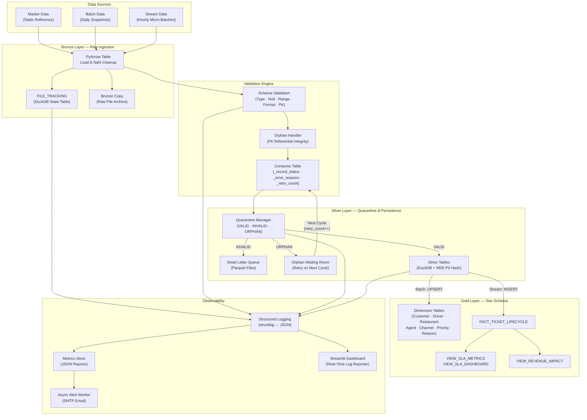

<p align="center">
  <h1 align="center">🍔 FastFeast Data Solution</h1>
  <p align="center">
    <strong>A Production-Grade, Configuration-Driven ELT Pipeline & Analytical Data Warehouse for Food Delivery Operations</strong>
  </p>
  <p align="center">
    <em>Python · PyArrow · DuckDB · Structlog · Streamlit</em>
  </p>
</p>

---

## Executive Summary

FastFeast Data Solution is a fully automated data engineering platform built to ingest, validate, transform, and warehouse operational data for a food delivery company. The system processes three distinct data streams&mdash;**Master** (static reference data), **Batch** (daily dimensional snapshots), and **Stream** (hourly transactional micro-batches)&mdash;through a strict **Medallion Architecture** (Bronze → Silver → Gold) powered by an embedded DuckDB analytical database.

The pipeline ingests raw CSV and JSON files, enforces multi-layered schema validation using vectorized PyArrow operations, applies PII hashing at the database layer, routes invalid records to a Dead Letter Queue with automatic orphan retry semantics, and materializes a fully normalized OLAP Star Schema with pre-computed SLA and revenue-impact analytics views&mdash;all orchestrated via a strict two-phase execution model that guarantees dimensional integrity before any fact record is written.

---

## Design Philosophy

The FastFeast codebase is built on a set of deliberate engineering principles that prioritize correctness, auditability, and maintainability over premature optimization.

### Configuration-Driven Logic

No schema definition, validation rule, or pipeline threshold is hardcoded. The system is governed by two declarative YAML contracts:

- **`config.yaml`** &mdash; Defines all operational parameters: database paths, batch schedules, retry limits, worker counts, SLA thresholds, datetime formats, logging levels, and alert recipients.
- **`files_metadata.yaml`** &mdash; Defines the complete schema contract for every ingested file: column names, data types, primary keys, foreign key relationships, nullability, value ranges, expected values, PII markers, and format constraints (email, phone).

Adding a new data source requires registering it in `files_metadata.yaml`; no application code changes are needed.

### Stateless, Pure Functions

Processing functions are designed to be stateless and side-effect free. `schema_validation.validate_table()`, `compose_table()`, and `build_validated_table()` accept a PyArrow Table and a set of expected constraints, returning new tables and status arrays without mutating inputs. This enables safe concurrent execution across threads and trivial unit testing of each layer in isolation.

### Idempotency & Exactly-Once Semantics

Every file processed by the pipeline is tracked in a DuckDB `FILE_TRACKING` table keyed on `(FILE_PATH, PIPELINE_RUN_ID)` with SHA-256 content hashes and attempt counters. The `try_acquire()` function implements a compare-and-swap pattern: if a file's hash matches a previously successful run, it is skipped; if a file has exceeded `max_attempts`, it is permanently skipped. All tracker mutations use `ON CONFLICT ... DO UPDATE` upserts, making the entire tracking layer idempotent regardless of how many times a cycle is rerun. Stream Silver loads use `NOT EXISTS` anti-join guards against duplicate primary keys, while batch loads use `CREATE OR REPLACE` for full-refresh semantics.

### DRY Principles & Metadata Caching

Schema introspection functions (`expected_types()`, `not_null_column()`, `column_format()`, `get_column_range()`, `get_column_pk()`, `get_column_fk()`) are centralized in `utilities/validation_utils.py` and share a single YAML-parsed metadata object cached at module load time. The `build_validated_table()` function in `file_processing.py` composes these into a single pipeline step, eliminating duplicated validation logic between the batch and stream code paths.

### Multi-Threaded Parallel Processing

Both the batch dimension phase and the stream micro-batch phase leverage Python's `ThreadPoolExecutor` to process files concurrently. A `threading.Lock` serializes writes to DuckDB (which does not support concurrent write transactions), while all read-heavy validation and PyArrow transformation work runs in parallel. A separate `tracker_db_lock` protects file-tracking state mutations from race conditions.

### Vectorized Operations over Row Iteration

All data validation, masking, and filtering operations use PyArrow's columnar compute kernel (`pyarrow.compute`) rather than row-by-row Python loops. Type-cast attempts, null checks, regex pattern matching, range comparisons, and duplicate detection are expressed as vectorized array operations&mdash;providing orders-of-magnitude performance improvements on large datasets.

---

## Data Architecture: The Medallion Pipeline

### Architecture Diagram



### Bronze Layer — Raw Ingestion & State Tracking

The Bronze layer is the system's point of entry. It is responsible for three concerns:

1. **File Detection & Acquisition**: The `Micro_batch_File_Watcher` daemon polls the stream directory on a configurable interval. The batch orchestrator (`parallel_process.py`) copies date-partitioned source folders to a Bronze staging area. Both paths use `try_acquire()` to atomically claim a file via SHA-256 hash comparison against the `FILE_TRACKING` table, preventing double-processing.

2. **Raw Archival**: The `bronze_writer.py` module copies every ingested file into a `data/bronze/{date}/{hour}/` directory structure, preserving the raw source as an immutable audit trail.

3. **PyArrow Materialization**: The `pyarrow_table.py` bridge converts CSV files via `pyarrow.csv.read_csv()` and JSON files via a custom loader that normalizes `NaN` and `None` variants into proper PyArrow nulls.

**State Machine**: Each file transitions through `PENDING → PROCESSING → VALIDATED → SUCCESS` (or `FAILED_SCHEMA` / `FAILED`) stages tracked in DuckDB. Stages are updated atomically with the current `PIPELINE_RUN_ID`.

### Silver Layer — Validation, Quarantine, & Persistence

The Silver layer applies the system's core data quality contracts:

1. **Schema Validation** (`schema_validation.py`): For each column, the validator attempts a direct `pc.cast()` to the expected PyArrow type. On success, it checks nullability, format (email/phone regex), and numerical range constraints. On cast failure, it falls back to regex-based type pattern matching to precisely tag _which rows_ have type errors rather than failing the entire file. Primary key uniqueness is validated via `pc.value_counts()` with duplicate index extraction.

2. **Orphan Detection** (`orphans_handler.py`): After schema validation, rows with foreign key values absent from the loaded dimension tables are flagged as `ORPHAN` rather than `INVALID`. This prevents data loss when stream transactions reference entities (customers, drivers) that haven't yet appeared in the daily batch load.

3. **Record Composition** (`compose_table()`): Three metadata columns (`_record_status`, `_error_reasons`, `_retry_count`) are appended to the PyArrow Table. The `_error_reasons` column is a structured `Map<String, List<String>>` mapping error categories (`data_type`, `not_allowed_nulls`, `format`, `range`, `duplicated`, `orphan`) to the specific columns that failed.

4. **Quarantine Routing** (`quarantine_manager.py`): The composed table is split three ways:
   - **VALID** → Metadata columns stripped, clean table forwarded to Silver persistence.
   - **INVALID** → Written to `validation/quarantine/{table}/{date}/{run_id}.parquet`.
   - **ORPHAN** → Written to `validation/orphans/{table}/{date}/{run_id}.parquet`. On the next cycle, `orphan_retriever.py` reloads these with an incremented `_retry_count`. Orphans exceeding `retry_attempts` (from `config.yaml`) are expired into the DLQ.

5. **Silver Persistence** (`loader.py → load_to_silver()`): Clean tables are registered as temporary PyArrow views in DuckDB. PII-marked columns are hashed inline using `MD5(CAST(column AS VARCHAR))` at the SQL level — delegating cryptographic operations to DuckDB's native engine rather than PyArrow. Batch files use full-refresh (`CREATE OR REPLACE TABLE`); stream files use idempotent `INSERT ... WHERE NOT EXISTS` against primary keys.

### Gold Layer — Star Schema & Analytical Views

The Gold layer materializes the final analytical data model:

1. **Dimension Tables**: Batch Silver tables are upserted into Gold dimensions (`DIM_CUSTOMER`, `DIM_DRIVER`, `DIM_RESTAURANT`, `DIM_AGENT`, `DIM_CHANNEL`, `DIM_PRIORITY`, `DIM_REASON`) using `INSERT ... ON CONFLICT (pk) DO UPDATE SET` for SCD Type 1 overwrites. Dimensions are flattened (e.g., `DIM_CUSTOMER` includes denormalized `CITY_NAME`, `REGION_NAME`, `SEGMENT_NAME`) to eliminate runtime joins for DuckDB's columnar scan engine.

2. **Fact Table**: `FACT_TICKET_LIFECYCLE` is assembled from joined `SILVER_TICKETS`, `SILVER_ORDERS`, and `SILVER_TICKET_EVENTS` using a CTE-based upsert. Surrogate keys are auto-incremented from the current maximum. The fact table captures order financials (subtotal, discount, delivery fee, total), support performance (first response time, resolution time, SLA breaches), and audit metadata (event counts, reopen counts, batch IDs).

3. **Analytical Views**:
   - **`VIEW_SLA_METRICS`** — Computes per-ticket SLA metrics (first response time, resolution time, SLA breach flags, reopen detection) by traversing ticket event timelines.
   - **`VIEW_SLA_DASHBOARD`** — Aggregates SLA metrics by geographic and operational dimensions with breach rates, reopen rates, and financial impact summaries.
   - **`VIEW_REVENUE_IMPACT`** — Summarizes financial exposure by restaurant, channel, priority, and reason with anti-fanout CTE guards to prevent join amplification.
   - **`quality_metrics.sql`** — Standalone queries for data quality KPIs: null rates, type error rates, quarantine counts, processing latency.

### Two-Phase Orchestration

The system enforces a strict execution order via `run_all.py`:

- **Phase 1 — Dimensions**: Master reference data is loaded first, followed by daily batch data. Both must complete successfully before the barrier is crossed. This guarantees that all primary keys exist in dimension tables before any foreign-key-bearing stream records are processed.
- **Phase 2 — Facts**: The `Micro_batch_File_Watcher` processes stream data, loads Silver tables, assembles the fact table, and refreshes all analytical views.

If Phase 1 fails, Phase 2 is never started. This eliminates orphan records caused by dimension-fact race conditions.

---

## Technology Stack

| Technology | Role | Rationale |
|---|---|---|
| **Python 3.10+** | Orchestration, glue logic, threading | Ecosystem maturity; `dataclasses` + `dacite` for typed config deserialization |
| **PyArrow** | In-memory columnar processing | Vectorized compute kernels (`pc.cast`, `pc.match_substring_regex`, `pc.indices_nonzero`) eliminate row-by-row loops; zero-copy integration with DuckDB |
| **DuckDB** | Embedded analytical database | OLAP-optimized columnar storage; native `MD5()` for PII hashing; `ON CONFLICT` upserts; `CREATE OR REPLACE VIEW` for live analytics; no external server dependencies |
| **structlog** | Structured JSON logging | Machine-parseable log lines; ISO timestamps; bound context fields for correlation |
| **Streamlit** | Observability dashboard | Real-time log streaming with auto-refresh; Plotly charts for validation trends; per-file issue breakdown |
| **YAML + dacite** | Configuration contracts | Strict deserialization into Python dataclasses; single source of truth for all schema and operational parameters |

---

## Pipeline Observability

The FastFeast observability stack provides three layers of production visibility:

### Centralized Metrics (`observability/metrics.py`)

Every validation pass records structured metrics into a JSON report: total rows processed, clean vs. failed file counts, per-file issue breakdowns (null, type, enum, range, format, missing columns), and processing latency in milliseconds. These reports are persisted to `logs/validation_metrics_*.json` and serve as the data source for both the dashboard and the alert system.

### Asynchronous Alerting (`observability/alerts.py`)

A dedicated daemon thread (`fastfeast-alert-worker`) consumes alert tasks from a bounded queue. On validation failure, an HTML-formatted email is dispatched via SMTP with a visual summary: pass/fail status, per-file issue counts, and aggregate statistics. The queue implements backpressure (oldest alert dropped when full), and the worker thread is registered with `atexit` for graceful shutdown.

### Real-Time Dashboard (`observability/app.py`)

A Streamlit application provides a live operational view:

- **Live Log Stream** — Tail of pipeline log files with level/logger/message filtering and a per-minute event timeline.
- **Validation Metrics** — Run-over-run clean rate trends, per-file issue type stacked bar charts, and a summary table with conditional formatting.
- **File Browser** — Discovery and inspection of all `.log` and `.json` metric files under the project root.

The dashboard uses PyArrow tables internally (via `log_parser.py`) for consistent columnar processing of log data, with configurable auto-refresh intervals.

### Log Architecture

All pipeline modules emit structured logs via `structlog` processors (JSON-rendered, ISO-timestamped, level-tagged). The underlying `logging` handlers use `RotatingFileHandler` with configurable size limits and backup counts. Two named loggers (`pipeline`, `validation`) route to separate log files. Stream-processing modules use a third logger (`stream_monitor`) for daemon-specific telemetry.

---

## Project Structure

```
FastFeast/
├── pipeline/
│   ├── config/           # config.yaml, files_metadata.yaml, dataclass loaders
│   ├── ingestion/        # File watcher, tracker, bronze writer, daemon, file processing
│   ├── validation/       # Schema validation, orphan handler
│   ├── transformation/   # PII masker (PyArrow-based)
│   ├── bridge/           # CSV/JSON → PyArrow Table converter
│   └── loading/          # Silver & Gold DuckDB persistence (loader.py)
├── dwh/
│   ├── bronze/           # FILE_TRACKING DDL & init
│   ├── silver/           # Quarantine manager, orphan retriever
│   ├── gold/             # Dimension & fact DDLs, SLA views
│   └── analytics/        # Revenue impact view, quality metric queries
├── orchestration/        # Two-phase runner (run_all.py), parallel processor
├── observability/        # Metrics, alerts, log parser, Streamlit dashboard
├── utilities/            # DB connection, file hashing, validation utils, metadata cache
├── support/              # Structured logger configuration
└── data_generation/      # Synthetic data generators with intentional quality defects
```

---

<p align="center">
  <sub>FastFeast Data Solution — Engineered for correctness, built for observability.</sub>
</p>
